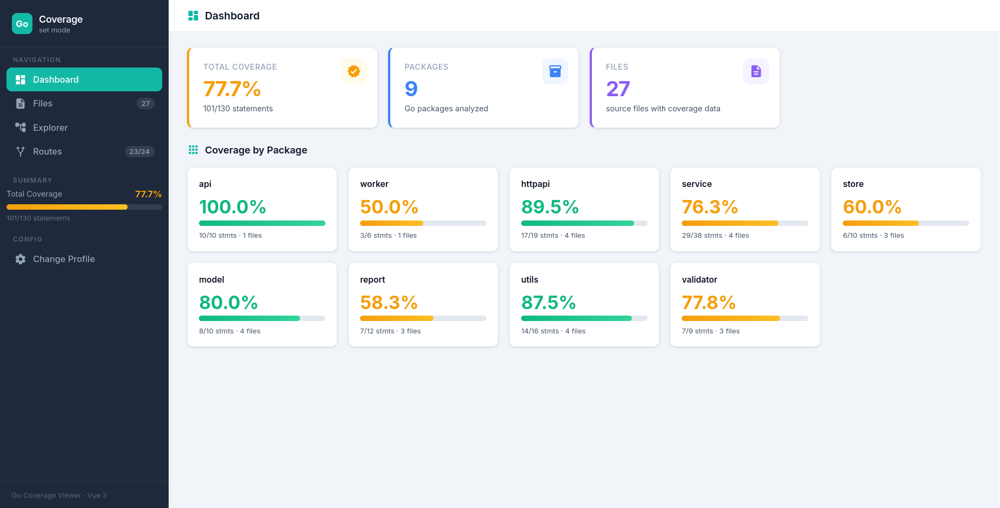
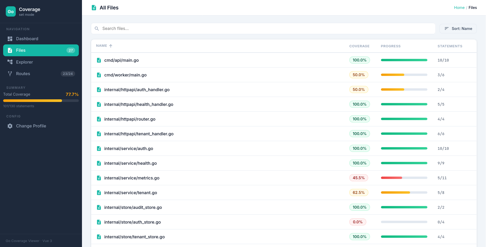
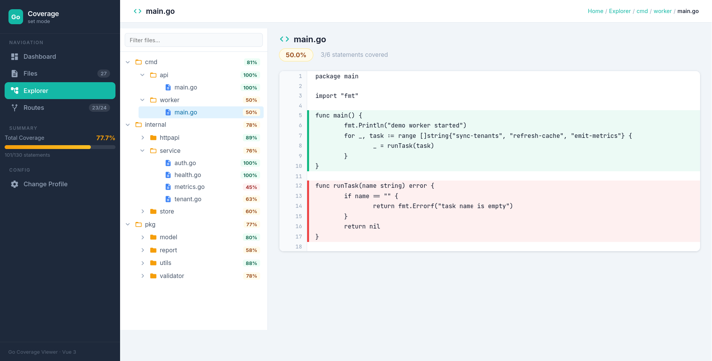
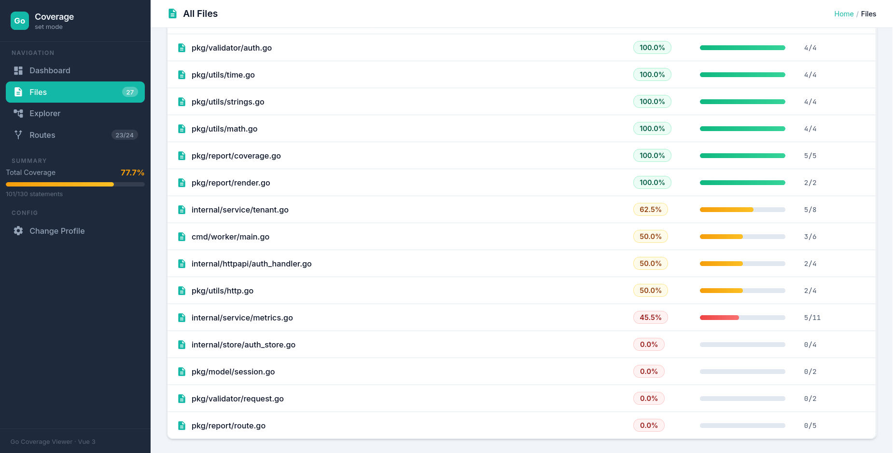
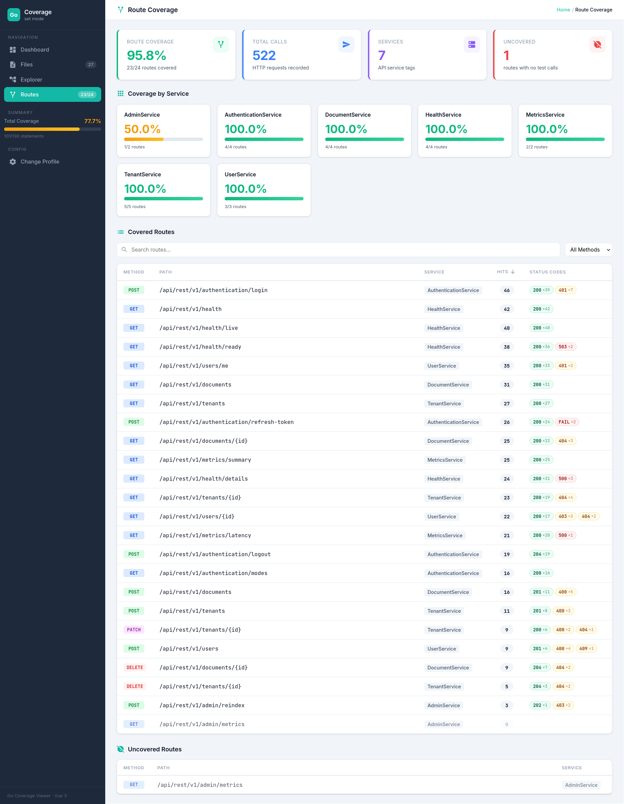

# sixtine-coverage

A self-contained, interactive Go coverage dashboard. Feed it a `cover.out` file and get a browsable HTML report with per-file highlighting, folder drill-down, and optional HTTP route coverage.

## Quickstart

```bash
# install
go install github.com/sixtineai/sixtine-coverage

# generate coverage report in your go project
go test -coverprofile=cover.out ./...

# render to html
sixtine-coverage -coverage cover.out -codebase . -out coverage.html
```

## Demo

- Open the bundled demo report: [docs/demo-report.html](docs/demo-report.html)

## Screenshots

### Dashboard



### Files and explorer





### Route coverage



**Two ways to use it:**

| Mode | Best for | Output |
|---|---|---|
| **CLI** (`go install`) | CI pipelines, sharing reports | Single `.html` file you can open anywhere |
| **Docker** | Persistent dashboards, team servers | Live web UI on port 80 |

---

## CLI, single-file HTML report

### Install

```bash
go install github.com/sixtineai/sixtine-coverage
```

This gives you the `sixtine-coverage` binary. The HTML template is compiled into the binary, no extra files needed.

### Generate a report

```bash
# default
sixtine-coverage -coverage cover.out

# full, with route coverage
sixtine-coverage \
  -coverage  ./cover.out \
  -codebase  /path/to/your-project \
  -route-coverage ./route-coverage.rcov \
  -out       report.html
```

Open `report.html` in any browser. Everything (code, data, UI) is inlined, no server required.

### Flags

| Flag | Description | Default |
|---|---|---|
| `-coverage` | Path to Go `cover.out` file | *(required)* |
| `-codebase` | Path to the Go source code root | `./` |
| `-route-coverage` | Path to `route-coverage.rcov` file | *(none)* |
| `-out` | Output HTML file path | `coverage.html` |

### Typical CI usage

```bash
# in your CI pipeline
go test -coverprofile=cover.out ./...
sixtine-coverage -coverage cover.out -codebase . -out coverage.html

# upload coverage.html as a build artifact
```

---

## Docker, live dashboard

Mount your coverage data and source code into the container. The dashboard auto-loads on startup.

### Quick start

```bash
docker run -d -p 8080:80 \
  -v $(pwd)/cover.out:/data/coverage/cover.out:ro \
  -v $(pwd):/data/code:ro \
  -e SIXTINEAI_COVERAGE_URL=/data/coverage/cover.out \
  -e SIXTINEAI_SOURCE_ROOT=/data/code/ \
  ghcr.io/sixtineai/sixtine-coverage:latest
```

Then open http://localhost:8080.

### Docker Compose

Save this as `docker-compose.yml` next to your project:

```yaml
services:
  coverage:
    image: ghcr.io/sixtineai/sixtine-coverage:latest
    ports:
      - "8080:80"
    volumes:
      - ./cover.out:/data/coverage/cover.out:ro
      - ./:/data/code:ro
      # Optional: mount route coverage
      # - ./route-coverage.rcov:/data/coverage/route-coverage.rcov:ro
    environment:
      SIXTINEAI_COVERAGE_URL: /data/coverage/cover.out
      SIXTINEAI_SOURCE_ROOT: /data/code/
      # SIXTINEAI_ROUTE_COVERAGE_URL: /data/coverage/route-coverage.rcov
```

```bash
go test -coverprofile=cover.out ./...
docker compose up -d
# → http://localhost:8080
```

### Environment variables

| Variable | Description | Default |
|---|---|---|
| `SIXTINEAI_COVERAGE_URL` | URL/path to the `cover.out` file | `./cover.out` |
| `SIXTINEAI_SOURCE_ROOT` | Base path for serving Go source files | *(empty)* |
| `SIXTINEAI_MODULE_PREFIX` | Module prefix to strip from paths (auto-detected from coverage) | *(empty)* |
| `SIXTINEAI_ROUTE_COVERAGE_URL` | URL/path to a `route-coverage.json` file | *(empty)* |

When a coverage URL or inline data is set, the config screen is skipped and data loads automatically.

---

## Generating input files

### `cover.out`

Standard Go coverage profile:

```bash
go test -coverprofile=cover.out ./...
```

### `route-coverage.rcov`

Optional. A text-based route coverage profile (inspired by Go's `cover.out` format). Lists all API routes with hit counts and status code breakdowns:

```
mode: status
# AuthenticationService
GET /api/rest/v1/authentication/modes 200:1
POST /api/rest/v1/authentication/login 5 200:2
POST /api/rest/v1/authentication/refresh-token 200:2 -1:1
# TenantService
GET /api/rest/v1/tenants 200:4
GET /api/rest/v1/tenants/{id} 0
```

Format rules:
- `mode: status` header line
- `# ServiceTag` comment lines group routes by service
- Each route: `METHOD /path counts`
- `0` = uncovered (zero hits)
- `4` = 4 calls with unspecified status
- `200:3` = 3 calls returning HTTP 200
- `2 200:3` = 2 unspecified + 3×200 = 5 total hits
- `-1:2` = 2 connection failures

---

## Development

The project is a Vue 3 + Vite SPA with a Go CLI wrapper that produces self-contained HTML reports.

### Prerequisites

- Node.js ≥ 18 and pnpm
- Go ≥ 1.21

### Project structure

```
├── main.go                  # Go CLI, embeds dist/index.html, injects data
├── dist/index.html          # Built single-file SPA (committed, used by go:embed)
├── index.html               # Vite entry point (dev)
├── vite.config.js           # Vite config, standard + single-file mode
├── src/
│   ├── main.js              # Vue app bootstrap
│   ├── App.vue              # Root component, config screen + main layout
│   ├── config/index.js      # Runtime config from window.configs / env vars
│   ├── components/
│   │   ├── ConfigScreen.vue       # Initial setup form (URL inputs)
│   │   ├── DashboardView.vue      # Overview with coverage stats
│   │   ├── FilesView.vue          # Flat file list with coverage bars
│   │   ├── FileCoverage.vue       # Per-file source view with line highlighting
│   │   ├── FolderView.vue         # Folder-level aggregation
│   │   ├── TreeExplorer.vue       # Folder tree sidebar
│   │   ├── TreeNode.vue           # Recursive tree node
│   │   └── RouteCoverageView.vue  # HTTP route coverage table
│   └── utils/
│       ├── coverage.js      # cover.out parser → file/line/statement data
│       ├── data.js          # Data loading (fetch or gzip+base64 decode)
│       └── routeCoverage.js # Route coverage rcov parser
└── docker/
    ├── Dockerfile           # Multi-stage: node build → nginx
    ├── nginx.conf           # Serves SPA + mounted data volumes
    └── entrypoint.sh        # Injects SIXTINEAI_* env vars into HTML at boot
```

### How it works

1. **Vite builds** the Vue app into a single `dist/index.html` (all JS/CSS inlined via `vite-plugin-singlefile`).
2. The HTML contains a `// CONFIGURATIONS_PLACEHOLDER` script marker.
3. **Go CLI mode:** `main.go` embeds `dist/index.html` at compile time via `//go:embed`. At runtime it reads the coverage profile, collects referenced source files, gzip+base64-encodes everything, and replaces the placeholder with a `window.configs = {...}` object. The result is a single portable HTML file.
4. **Docker mode:** `entrypoint.sh` replaces the same placeholder with `SIXTINEAI_*` environment variables at container start. Nginx serves the SPA and proxies mounted volumes for live file access.

### Local development

```bash
pnpm install
pnpm dev          # → http://localhost:5173 with hot reload
```

The config screen lets you point to a local `cover.out` URL during development.

### Building

```bash
# Build the single-file dist/index.html (required before go build)
pnpm build:single

# Build the Go binary
go build -o sixtine-coverage .

# Or just run directly
go run . -coverage cover.out -codebase /path/to/project
```

### Rebuilding `dist/index.html`

The committed `dist/index.html` must be rebuilt whenever the frontend changes:

```bash
pnpm build:single
git add dist/index.html
```

This file is tracked in git so that `go install` works directly from the repository.
